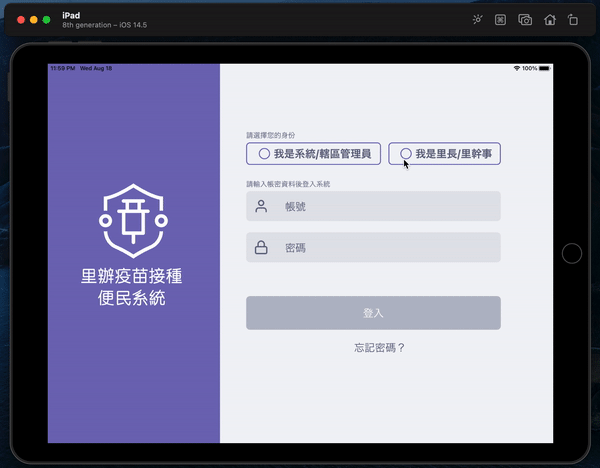

# Swift Projects Showcase

Projects included:
## 1. Medicine Distribution Tracking App ##
- Designed for a regular iPad that is used to monitor vaccine or medicine distribution from all registered clinics in Taipei
- The app can be scaled forward by relying on REST API, and the app can also be scaled backwar by relying on Core Data to accommodate rural areas where WiFi signals are still limited
<table>
  <td>  </td>
</table>

## 2. Card Scanner for Text Identification using Machine Learning Framework in Core ML ##
- Identify 3 distinct information (alphabets, numbers, and Chinese characters) using machine learning framework (Vision from Core ML) and AVFoundation camera module
- The text identification system can handle two different inputs: using camera input or using an uploaded picture
<table>
  <td>  </td>
</table>

## 3. Time Converter using REST API ##
- Using login credentials to retrieve information stored in Web API
- In addition, as long as users are logged in, users can update their time zone preference
<table>
  <td>  </td>
</table>
