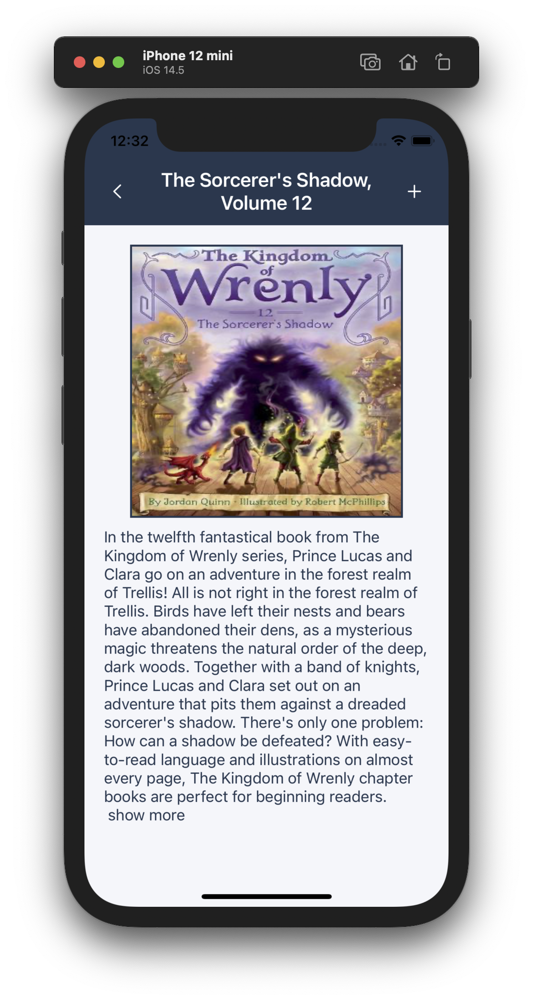

# Swift Projects Showcase

Projects included:
## 1. Vaccine Distribution Tracking App ##
- Designed for an iPad (10.2 inch to 11 inch for an optimal display) that is used to monitor vaccine or medicine distribution from all registered clinics
- Patients can then register for an appointment by entering their information, such as name, phone, birthdate, and ID number
- The app can be scaled forward by relying on REST API, and the app can also be scaled backwar by relying on Core Data to accommodate rural areas where WiFi signals are still limited
<table>
<tr>
  <td> 
  <td> 
</tr>
</table>

## 2. Card Scanner for Text Identification using Machine Learning Framework in Core ML ##
- Identify 3 distinct information (alphabets, numbers, and Chinese characters) using machine learning framework (Vision from Core ML) and AVFoundation camera module
- The text identification system can handle two different inputs: using camera input or using an uploaded picture
<table>
  <td>  </td>
</table>

## 3. Bookstore Catalogue using TableView ##
- Using login credential to retrieve information stored in API
- In this app, users can browse through bookstores listed as table cells
- Users can navigate through the app by clicking at a particular bookstore to view what books that are sold
- Users can also click at any book title that is currently sold to view its summary
<table>
<tr>
<td> 
<td> 
</tr>
</table>

## 4. Time Converter using REST API ##
- Using login credentials to retrieve information stored in Web API
- In addition, as long as users are logged in, users can update their time zone preference
<table>
  <td>  </td>
</table>

